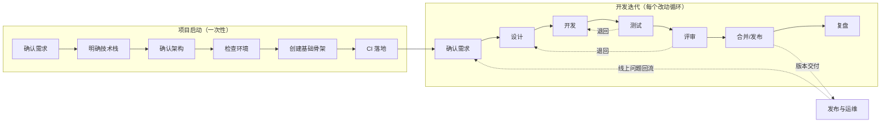

# 标准开发流程（总纲）

> 适用范围：本项目从立项到迭代演进的全过程。
> 核心原则：**规模可裁剪，环节不可跳**——再小的改动，也要有任务描述、有验证、有记录。
> 本文技术栈无关：只约定"做什么、做到什么程度算完成"，不约定用什么工具实现。

---

## 流程全景

软件生命周期分两段走：**启动链走一次，迭代循环反复走**；循环的产出经发布流向运维，线上问题回流到循环，形成闭环。

- 启动链是生命周期"需求分析 → 设计 → 实现"在**项目级**的展开；迭代循环是"需求 → 设计 → 实现 → 测试 → 交付"在**改动级**的循环。
- 每个阶段有明确的**完成标准（DoD）**，达标才进入下一阶段；不达标就地修复或退回上一阶段，**禁止把问题带到下游**。
- 每个阶段结束**停下确认**，通过后再继续（AI 协作时由人把关，见 §6）。

---

## 1. 项目启动流程（一次性）

> 需求确认到"关键约束清晰"即可进入选型：细粒度需求在迭代循环里反复发生，不在这里一次定完。
> 启动链不裁剪——步骤可以压缩在很短时间内完成，但每步 DoD 不可省。

### 1.1 确认需求

| 要素 | 内容 |
|---|---|
| 目标 | 明确项目解决什么问题、关键约束是什么、明确不做什么 |
| 输入 | 想法、业务目标、用户痛点 |
| 产出物 | 项目需求说明：核心场景清单 + 关键约束（性能/部署环境/团队熟悉度等）+ 范围边界 |
| DoD | 核心场景可列举；关键约束明确；写明不做什么；约束足以支撑技术选型 |

**退回条件**：约束说不清、场景互相矛盾 → 补齐后再选型。

### 1.2 明确技术栈

| 要素 | 内容 |
|---|---|
| 目标 | 基于关键约束选定技术栈 |
| 输入 | 需求说明（尤其关键约束） |
| 产出物 | 选型记录：每个关键维度（语言/框架/存储/部署方式）选了什么、为什么、否决了哪些备选 |
| DoD | 每个维度有明确选择；选择理由与约束一一对应；否决理由可查——防止日后重新争论 |

**退回条件**：选型与某条约束冲突 → 回需求修订约束，或换选型。

### 1.3 确认架构

| 要素 | 内容 |
|---|---|
| 目标 | 确定系统如何组织：模块怎么划分、彼此怎么依赖 |
| 输入 | 需求说明 + 技术栈 |
| 产出物 | 架构说明：模块划分、依赖规则、关键数据流、关键技术风险的对策 |
| DoD | 模块划分与依赖规则成文；关键技术风险（并发/一致性/安全等）有对策或标记待解；文档入库 |

**退回条件**：架构承载不了某条约束 → 回技术栈或需求。

### 1.4 检查环境

| 要素 | 内容 |
|---|---|
| 目标 | 确保开发/构建/运行/验证所需工具链在真实机器上就绪 |
| 输入 | 技术栈与架构对环境的要求 |
| 产出物 | 环境清单：工具与版本、安装配置方式，写成文档让新人可复现 |
| DoD | 清单覆盖构建/运行/测试/发布所需；每项**实际验证过**（跑过版本命令或最小示例），不是"应该装过"；文档入库 |

**退回条件**：环境无法满足选型 → 解决环境问题，或回技术栈调整。

### 1.5 创建基础骨架

| 要素 | 内容 |
|---|---|
| 目标 | 把架构落成可构建、可运行的最小工程 |
| 输入 | 架构说明 + 环境清单 |
| 产出物 | 可运行的工程骨架 + 版本控制仓库 + README（如何跑起来） |
| DoD | **端到端跑通一次**：能构建、能运行、至少一个示例验证通过、已提交入库；仓库结构体现模块划分；新人照 README 能把项目跑起来；项目级 AGENTS.md 已建立并指向本流程文档 |

**退回条件**：骨架与架构对不上 → 改骨架，不将就。

### 1.6 CI 落地

| 要素 | 内容 |
|---|---|
| 目标 | 把骨架的构建与验证交给流水线自动执行，作为环境健康的自动化检查 |
| 输入 | 骨架及其构建/验证方式 |
| 产出物 | CI 流水线：每次提交自动"构建 + 验证"，失败即暴露 |
| DoD | 一次真实提交触发流水线并跑绿；失败能第一时间暴露，而不是开发到一半才发现环境坏了 |

**退回条件**：流水线无法稳定跑绿 → 修流水线或回骨架检查，不带病进入迭代。

**启动完成的标志：CI 首次跑绿，项目进入迭代循环。**

---

## 2. 开发迭代循环（每个改动走一遍）

> 功能开发、缺陷修复、重构都走一遍，按 §7 的规则裁剪。

### 2.1 需求

| 要素 | 内容 |
|---|---|
| 目标 | 明确"做什么、为什么做、做到什么程度算完成" |
| 输入 | 想法、用户反馈、缺陷报告 |
| 产出物 | 一条任务描述：背景 + 要做什么 + 验收标准 |
| DoD | 验收标准可判断、范围边界清晰（写明不做什么）、大小适中（一次可交付） |

**退回条件**：描述含糊、验收标准无法判断 → 补充清楚后再往下走。

### 2.2 设计

| 要素 | 内容 |
|---|---|
| 目标 | 动手前想清楚"怎么做" |
| 输入 | 任务描述 |
| 产出物 | 简要设计说明：方案要点、影响范围、对外变化（接口/数据/行为）、风险与对策 |
| DoD | 方案已选定（备选有取舍理由）、影响范围列全、对现有功能的破坏点有对策、需同步的文档已识别 |

**退回条件**：设计与需求的验收标准对不上 → 回需求阶段澄清。

### 2.3 开发

| 要素 | 内容 |
|---|---|
| 目标 | 按设计实现，小步提交 |
| 输入 | 设计说明 |
| 产出物 | 代码 + 自测记录 + 同步更新的文档（接口/数据结构/用法有变化时） |
| DoD | 自检清单（§5.1）全过、改动可实际运行验证、提交说明能回答"改了什么、为什么"、无遗留调试代码（确需保留的 TODO 已注明原因） |

**退回条件**：开发中发现设计不可行 → 回设计阶段修订方案，不在代码里悄悄绕过。

### 2.4 测试

| 要素 | 内容 |
|---|---|
| 目标 | 证明改动符合验收标准，且没有破坏已有功能 |
| 输入 | 代码改动 + 任务的验收标准 |
| 产出物 | 测试记录：测了什么、怎么测的、结果如何；发现的缺陷清单 |
| DoD | 验收标准逐条验证通过、覆盖主流程 + 边界 + 异常场景、发现的缺陷每条有去向（已修或记录挂账） |

**退回条件**：主流程或验收标准验证不通过 → 回开发阶段。

### 2.5 评审

| 要素 | 内容 |
|---|---|
| 目标 | 由人确认改动质量、方案取舍与项目约定一致 |
| 输入 | 代码改动、测试记录、设计说明 |
| 产出物 | 评审结论：通过 / 修改后再审；意见清单 |
| DoD | 评审清单（§5.2）逐项过、每条意见有闭环（已修改，或说明为什么不改） |

**退回条件**：存在未闭环的关键意见 → 回开发阶段。

### 2.6 合并 / 发布

| 要素 | 内容 |
|---|---|
| 目标 | 把通过的改动安全并入主干并交付 |
| 输入 | 评审通过的改动 |
| 产出物 | 合并记录、变更日志条目、版本标识（如有版本号机制） |
| DoD | 合并前主干处于可用状态、变更日志已更新、交付内容与任务描述一致 |

**退回条件**：合并后发现问题 → 立即修复或回滚到上一个可用状态，不等下次。

### 2.7 复盘（按批次，可选但推荐）

| 要素 | 内容 |
|---|---|
| 目标 | 把本次踩的坑变成下一次的规则 |
| 产出物 | 改进项清单，每项有归属：改流程文档 / 改工具 / 新任务 |
| DoD | 改进项已落实归属，不是停留在口头 |

---

## 3. 发布与运维（生命周期后段）

- 迭代循环中的"合并/发布"负责**每次交付**；项目级发布指把一组已合并的改动打上版本、发布上线，且**可回滚**。
- 运维与版本演进：线上问题以缺陷或新需求的形式**回流到循环的"确认需求"**，闭环运转。

---

## 4. 质量门禁总览

任何改动进入主干前，必须满足以下**栈无关的最低标准**；每条标注检查方式——能自动的交给机器，不能自动的落到人：

| # | 门禁 | 标准 | 检查方式 |
|---|---|---|---|
| 1 | 可验证 | 改动效果有明确的验证方式，且已实际执行（自动化测试、运行演示均可） | **自动**：CI 跑构建与测试；无法自动化的，人工运行演示 |
| 2 | 自检通过 | 开发者自检清单（§5.1）全部通过 | **人工**：交付者勾选，评审人抽查 |
| 3 | 可追溯 | 提交说明能回答"改了什么、为什么改、怎么验证的" | **人工**：评审时检查；提交格式定义后可交 hook 校验 |
| 4 | 文档同步 | 接口、数据结构、使用方式有变化时，对应文档同一次改动内更新 | **人工**：评审清单（§5.2）已覆盖 |
| 5 | 可回退 | 清楚出问题后如何回到上一个可用状态 | **人工**：设计时确认，发布时复核 |

---

## 5. 自检与评审清单

### 5.1 开发者自检（AI 或人，交付前必过）

- [ ] 对照任务验收标准逐条自查，结果如实记录（通过/不通过/未测）
- [ ] 改动可运行验证，验证方式与结果已说明
- [ ] 说明了改了哪些文件、没动哪些东西
- [ ] 无调试残留；新增依赖/约定有说明
- [ ] 应同步的文档已同步，或在任务中注明"待同步"

### 5.2 评审人清单

- [ ] 实现与设计说明一致，偏离有理由
- [ ] 边界与异常情况有处理，不只是主流程能跑
- [ ] 不引入与项目既有约定冲突的做法
- [ ] 命名与结构可维护，注释只解释"为什么"
- [ ] 测试/验证覆盖了验收标准，AI 声称的"通过"以实际执行结果为准

---

## 6. AI 协作原则

**给 AI 拆任务**

- 一次只派一个可验证的小任务，附验收标准；不把大需求整包甩给 AI。
- 提供必要上下文：相关文件位置、项目约束、本流程文档路径，不让 AI 猜。

**AI 交付的纪律**

- 交付前必须完成 §5.1 自检并如实汇报，包括"验证到什么程度、什么没验证"。
- 不确定就问，不擅自扩大改动范围。

**人的职责**

- 审 AI 无法自证的部分：方案取舍、边界情况、与既有约定的一致性。

---

## 7. 流程裁剪

| 场景 | 裁剪方式 | 不可省略的环节 |
|---|---|---|
| 一两行的小修 | 需求/设计可在脑内完成 | 任务描述、验证、提交说明 |
| 紧急缺陷修复 | 先修后补 | 验证不可省；文档与复盘 48 小时内补齐 |
| 常规功能/重构 | 走全流程 | 全部 |

---

## 8. 配套规范（待总纲确认后细化）

以下细则将按本总纲确认后的结构展开，拆分方式与详略以评审意见为准：

- 分支与版本管理（分支模型、提交信息规范、版本号规则）
- 代码评审细则
- 测试与验收标准
- 启动产物模板（需求说明 / 选型记录 / 架构说明 / 环境清单）
- 发布与运维细则（发布流程、回滚预案、监控约定）
- 流程落地设施（仓库结构、PR/issue 模板、CI 配置样例——绑定具体技术栈时补）
